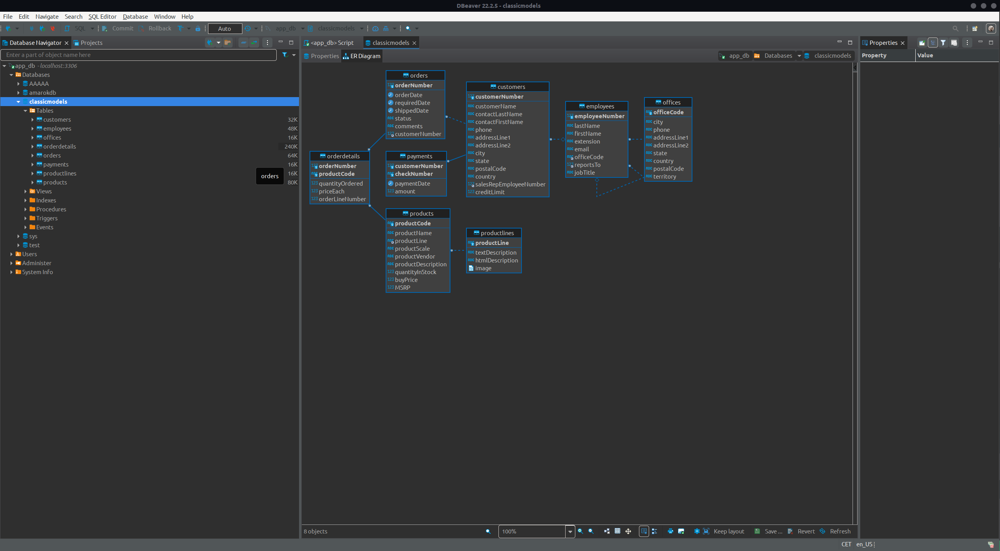

# setup-mysql

## Installation MySQL

```bash
sudo apt update
sudo apt install mysql-server
mysql_secure_installation
```

### Creation d'un nouvel utilisateur

```bash
sudo mysql
```

```sql
CREATE USER 'reader'@'localhost' IDENTIFIED BY 'password';
GRANT ALL PRIVILEGES ON *.* TO 'reader'@'localhost' WITH GRANT OPTION;
FLUSH PRIVILEGES;
```

`reader` pourra lire la base de données.

## Importation de la base de données depuis le fichier .sql

```bash
mysql -u reader -p < mysqlsampledatabase.sql
```

*note : Le scipt crée et sélectionne la base de données, le cas échéant, il faudrait la `CREATE DATABASE` et la `USE` avant*

on peut désormais voir la base de données



## Exportation de la base de données

```bash
mysqldump -u reader -p --databases classicmodels > mysqldump.sql
```
